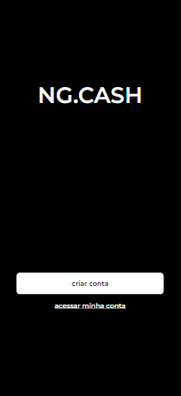
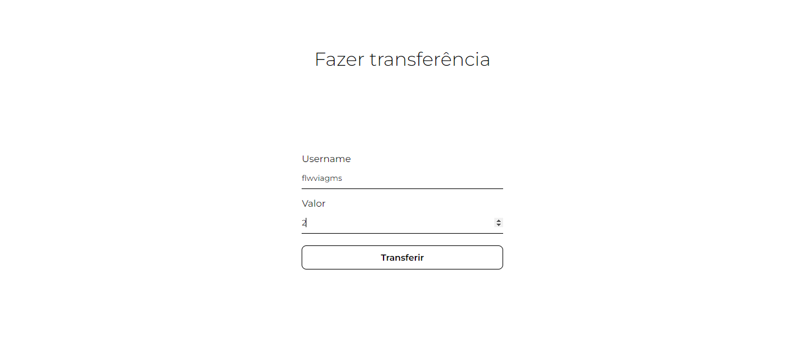

## Sobre o projeto
Aplicação feita em um desafio técnico da NG.CASH: Estruturar uma aplicação web fullstack, dockerizada, cujo objetivo seja possibilitar que usuários da NG consigam realizar transferências internas entre si.
<div align="center"> 
    Desktop
  
</div>
<div align="center"> 
    <p>Mobile</p>
  
</div>
<br/>

### Stacks
<details>
  <summary>Client</summary>
  <ul>
    <li><a href="https://reactjs.org/">React.js</a></li>
    <li><a href="https://www.typescriptlang.org/">Typescript</a></li>
    <li><a href="https://styled-components.com/">Styled Components</a></li>
  </ul>
</details>

### Funcionalidades

- [x] Página para realizar o cadastro na NG informando username e password.
- [x] Página para realizar o login informando username e password.

- Com o usuário logado, a página principal deve apresentar:

  - [x] balance atual do usuário;
  - [x] seção voltada à realização de transferências para outros usuários NG a partir do username de quem sofrerá o cash-in;
  - [x] tabela com os detalhes de todas as transações que o usuário participou;
  - [x] mecanismo para filtrar a tabela por data de transação e/ou transações do tipo cash-in/cash-out;
  - [x] botão para realizar o log-out;


### Variáveis de ambiente

Para rodar esse projeto, você precisará adicionar as seguintes variaveis de ambiente em um arquivo .env

`REACT_APP_BASE_API_URL=http://localhost:3001`
 
## Começando

### Pré-requisitos

Antes de começar, você precisará ter instalado em sua máquina as seguintes ferramentas: [Git](https://git-scm.com/), [Node.js](https://nodejs.org/en/) e [Typescript](https://www.typescriptlang.org/).
   
### Rodar localmanente

Clone o projeto

```bash
  git clone https://github.com/zirtaebn/ng-cash-frontend.git
```

Vá para o diretório do projeto

```bash
  cd ng-cash-frontend
```

Instale as dependências

```bash
  npm install
```

Inicie o servidor 

```bash
  npm start
```

## Uso

### Após criar sua conta, a aplicação te direcionará automaticamente para a página de login. Então, coloque suas infomacões cadastradas anteriormente.
<div align="center">
    Desktop
    
    
</div>

<div  align="center">
    <p>Mobile</p>
    
    </br>
    
</div>


### Página da sua conta. Se esse for seu primeiro acesso, seu balance terá R$ 100,00 automaticamente.
<div  align="center">
    Desktop
    
    </br>
    
</div>
<div  align="center">
    <p>Mobile</p>
    
    </br>
    
</div>

### Para transferir, aperte o botão "transferir" na página de sua conta. Então, você deverá informar o valor e o username para quem deseja realizar a transferência. O username deve ser válido, ou seja: a conta deve estar cadastrada no sistema. O meu username "zirtaebn" está disponível para transferência.
<div  align="center">
    Desktop
    
    
</div>
<div  align="center">
    <p>Mobile</p>
    
</div>

### Para ver as suas transferências, aperte em "ver transferências" na página de sua conta. Você poderá filtrar as tranferências recebidas e enviadas. Se clicar em uma transferência específica, terá mais detalhes.
<div  align="center">
    Desktop
    
    </br>
    
</div>
<div  align="center">
    <p>Mobile</p>
    
    </br>
    
</div>


## Contribuição

<a href="https://github.com/zirtaebn/ng-cash-frontend/graphs/contributors">
  
</a>
</br>
Contribuições são sempre bem vindas!

## Contato

Beatriz Sant'Anna - [@zirtaebn](https://twitter.com/zirtaebn) - zirtaebndev@gmail.com

Link do projeto: [https://github.com/zirtaebn/ng-cash-frontend](https://github.com/zirtaebn/ng-cash-frontend)

## Reconhecimentos

Recursos e bibliotecas úteis que utilizei no projeto.
 - [React Hook Form](https://react-hook-form.com/)
 - [React Icons](https://react-icons.github.io/react-icons/)
 - [React Spinners](https://www.npmjs.com/package/react-spinners)
 - [Axios](https://axios-http.com/ptbr/)
 - [React Router](https://reactrouter.com/en/main)
 